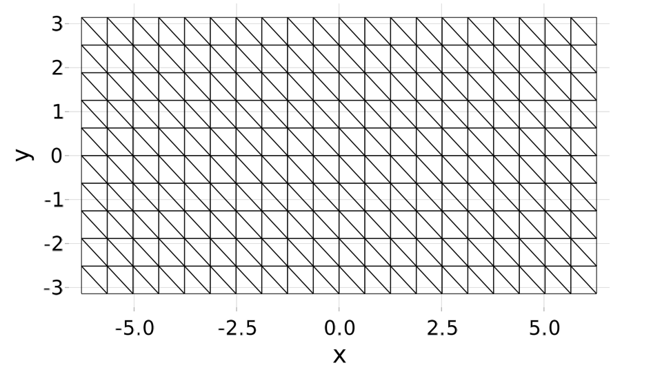
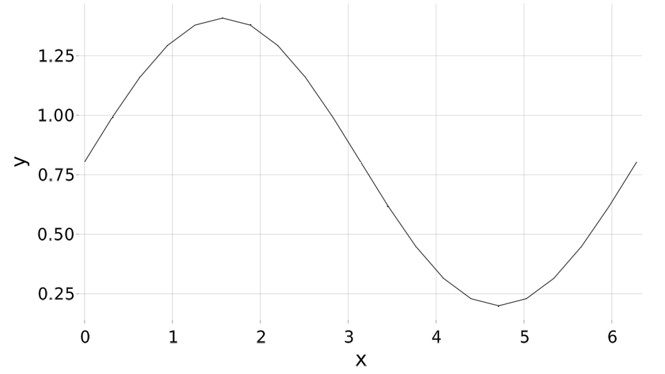
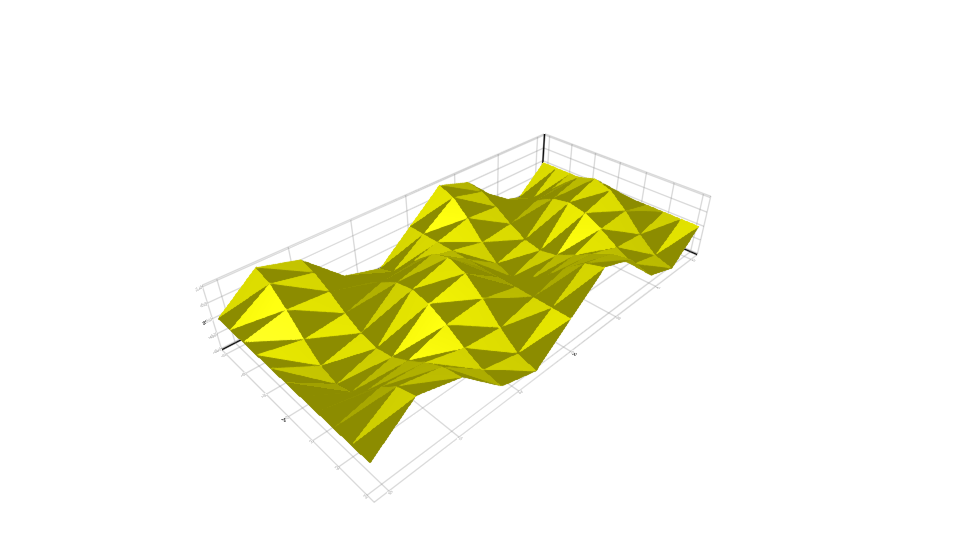
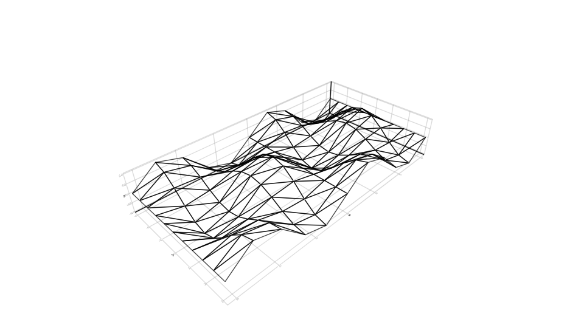
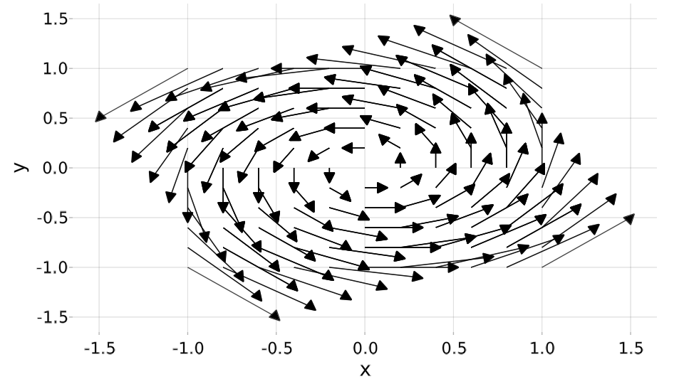

```@meta
EditURL = "<unknown>/README.jl"
```

# GridapMakie

[](https://gridap.github.io/GridapMakie.jl/stable)
[](https://gridap.github.io/GridapMakie.jl/dev)
[](https://travis-ci.com/gridap/GridapMakie.jl)
[](https://codecov.io/gh/gridap/GridapMakie.jl)

# This package is experimental

Things can and will break without deprecation or warning

# Examples

```@example README
using Gridap, GridapMakie, Makie

model = simplexify(CartesianDiscreteModel((-2pi,2pi,-pi,pi), (20,10)))
scene = plot(model)
```



```@example README
data = GridapMakie.demo_data(spacedim=1, valuetype=Float64)
scene = plot(data.u, data.model)
```



```@example README
model = simplexify(CartesianDiscreteModel((-2pi,2pi,-pi,pi), (10,10)))
V = TestFESpace(reffe=:Lagrangian, order=1, valuetype = Float64,
    conformity=:H1, model=model)
f(pt) = sin(pt[1])*cos(pt[2])
u = interpolate(V, f)
scene = mesh(u, model, color=:yellow)
```



```@example README
model = simplexify(CartesianDiscreteModel((-2pi,2pi,-pi,pi), (10,10)))
V = TestFESpace(reffe=:Lagrangian, order=1, valuetype = Float64,
    conformity=:H1, model=model)
f(pt) = sin(pt[1])*cos(pt[2])
u = interpolate(V, f)
scene = wireframe(u, model)
```



```@example README
model = CartesianDiscreteModel((-1,1,-1,1), (10,10))
V = TestFESpace(reffe=:Lagrangian, order=1, valuetype = VectorValue{2, Float64},
    conformity=:H1, model=model)
f(pt) = VectorValue(-pt[2], pt[1])
u = interpolate(V, f)
scene = arrows(u, model, arrowsize=0.1, lengthscale=0.5)
```



```@example README
model = CartesianDiscreteModel((-1,1,-1,1, -1, 1), (10,10, 10))
V_pressure = TestFESpace(reffe=:Lagrangian, order=1, valuetype=Float64, conformity=:H1, model=model)
V_velo = TestFESpace(reffe=:Lagrangian, order=1, valuetype=VectorValue{3, Float64},
    conformity=:H1, model=model)

pressure = interpolate(V_pressure, pt -> pt[1]*pt[2]*pt[3])
velocity = interpolate(V_velo, pt -> VectorValue(-pt[3]*pt[2],pt[3]*pt[1], 0.1*pt[1]*pt[2]))

color = GridapMakie.to_visualization_data(pressure, model) |> GridapMakie.get_nodalvalues
scene = arrows(velocity, model, arrowsize=0.1, lengthscale=0.2, arrowcolor=color)
```


---

*This page was generated using [Literate.jl](https://github.com/fredrikekre/Literate.jl).*

