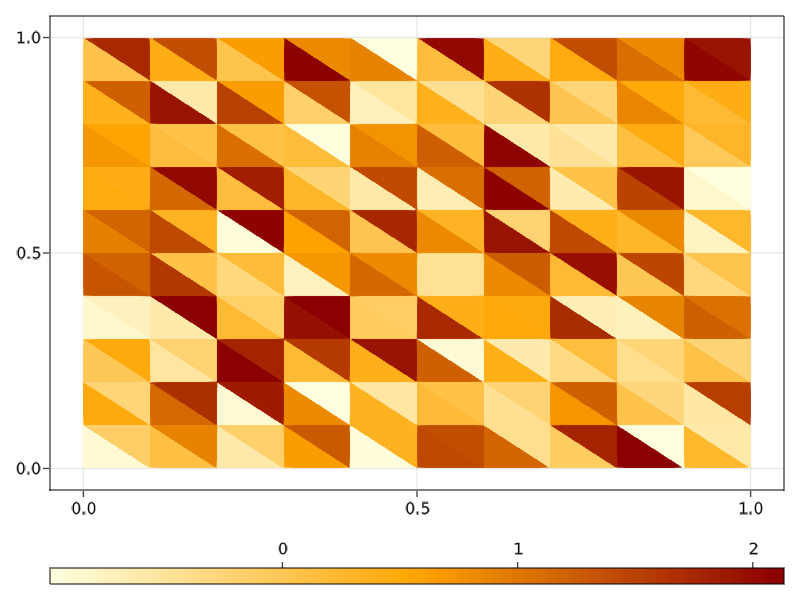

```@meta
EditURL = "<unknown>/README.jl"
```

## GridapMakie

[](https://gridap.github.io/GridapMakie.jl/stable)
[](https://gridap.github.io/GridapMakie.jl/dev)
[](https://travis-ci.com/gridap/GridapMakie.jl)
[](https://codecov.io/gh/gridap/GridapMakie.jl)

# Overview

The visualization of numerical results is an important part of FE computations. However, the current way of visualizing data from
[Gridap.jl](https://github.com/gridap/Gridap.jl) computations is to write it to disk in vtu format, thus relying on external software
such as Paraview. From the idea of visually inspecting data from Julia code directly or to manipulate it with packages of the Julia
open-source package ecosystem, [GridapMakie.jl](https://github.com/gridap/GridapMakie.jl) is born. As a part of the Google Summer of
Code 2021 program, GridapMakie adopts [Makie.jl](https://github.com/JuliaPlots/Makie.jl) as a second visualization back-end for
Gridap.jl simulations. This package is thought as a built-in tool to assess the user in their FE calculations with a smoother workflow
in a higlhy intuitive API.

# Installation

According to Makie's guidelines, it is enough to install one of its backends, e.g. GLMakie. Additionally, Gridap provides the plot objects
to be visualized

```julia
julia> ]
julia> add Gridap, GridapMakie, GLMakie
```

# Examples

First things first, we shall be using the three packages

````@example README
using Gridap, GridapMakie, GLMakie
````

Then, let us consider a simple, 2D simplexified cartesian mesh Ω

````@example README
domain = (0, 1, 0, 1)
cell_nums = (10, 10)
model = CartesianDiscreteModel(domain, cell_nums) |> simplexify
Ω = Triangulation(model)
````

The visualization of Ω along with the edges of its faces and its vertices

````@example README
fig = plot(Ω)
wireframe!(Ω, color=:black, linewidth=2)
scatter!(Ω, marker=:star8, markersize=20, color=:blue)
````


We now consider the nodal field uh

````@example README
reffe = ReferenceFE(lagrangian, Float64, 1)
V = FESpace(model, reffe)
uh = interpolate(x->sin(π*(x[1]+x[2])), V)
````

and plot it over Ω, adding a colorbar

````@example README
fig, _ , plt = plot(Ω, uh)
Colorbar(fig[1,2], plt)
````


On the other hand, we may as well plot a cell field

````@example README
celldata = π*rand(num_cells(Ω)) .-1
fig, _ , plt = plot(Ω, color=celldata, colormap=:heat)
Colorbar(fig[2,1], plt, vertical=false)
````



If we are only interested in the boundary of Ω

````@example README
Γ = BoundaryTriangulation(model)
fig, _ , plt = plot(Γ, uh, colormap=:algae, linewidth=10)
Colorbar(fig[1,2], plt)
````


In addition to the 2D plots, GridapMakie is able to handle more complex geometries. If we
take the mesh from the [first Gridap tutorial](https://gridap.github.io/Tutorials/stable/pages/t001_poisson/#Tutorial-1:-Poisson-equation-1)

````@example README
model = DiscreteModelFromFile("model.json")
Ω = Triangulation(model)
∂Ω = BoundaryTriangulation(model)
fig = plot(Ω, shading=true)
wireframe!(∂Ω, color=:black)
````


````@example README
v(x) = sin(π*(x[1]+x[2]+x[3]))
fig, ax, plt = plot(Ω, v, shading=true)
Colorbar(fig[1,2], plt)
````


we can even plot FE approximations in certain subdomains, e.g.

````@example README
Γ = BoundaryTriangulation(model, tags=["square", "triangle", "circle"])
fig = plot(Γ, v, colormap=:rainbow, shading=true)
wireframe!(∂Ω, linewidth=0.5, color=:gray)
````


Finally, by using Makie [Observables](https://makie.juliaplots.org/stable/interaction/nodes.html), we
can create animations or interactive plots. For example, if the nodal field has a time dependence

````@example README
t = Observable(0.0)
u = lift(t) do t
    x->sin(π*(x[1]+x[2]+x[3]))*cos(π*t)
end
fig = plot(Ω, u, colormap=:rainbow, shading=true, colorrange=(-1,1))
wireframe!(∂Ω, color=:black, linewidth=0.5)
framerate = 30
timestamps = range(0, 2, step=1/framerate)
record(fig, "images/animation.gif", timestamps; framerate=framerate) do this_t
    t[] = this_t
end
````


---

*This page was generated using [Literate.jl](https://github.com/fredrikekre/Literate.jl).*

